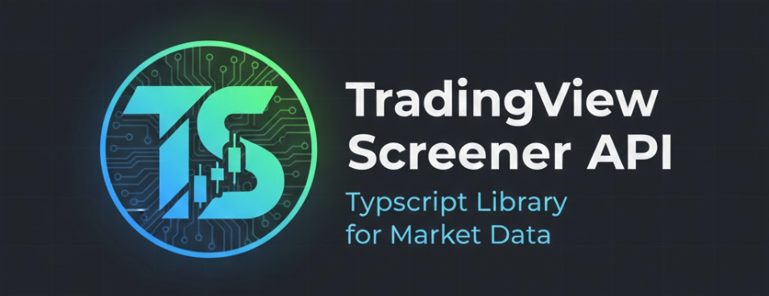

# TradingView Screener API

> Query TradingView's financial data with a type-safe, fluent TypeScript API. Screen stocks, crypto, forex, bonds, and futures using 13,000+ data fields.

<p align="center">
  <a href="https://www.npmjs.com/package/tradingview-screener"></a>
  <a href="https://www.npmjs.com/package/tradingview-screener"></a>
  <a href="https://github.com/jmargieh/tradingview-screener/blob/main/LICENSE"></a>
  <a href="https://github.com/jmargieh/tradingview-screener"></a>
</p>

<p align="center">
  
</p>

---

**[📚 Documentation](https://jmargieh.github.io/tradingview-screener/)** • **[🚀 Quick Start](#quick-start)** • **[💡 Examples](#use-cases)** • **[🤖 Claude Integration](#mcp-server-claude-desktop-integration)**

## Why Use This Library?

Traditional market data APIs require manual HTTP requests, pagination handling, and parsing. This library provides a **fluent, chainable interface** that lets you build complex market queries in seconds:

```typescript
// Find undervalued tech stocks with strong momentum
const stocks = await new StockScreener()
  .where(StockField.SECTOR.eq('Technology'))
  .where(StockField.PRICE_TO_EARNINGS_RATIO_TTM.lt(20))
  .where(StockField.RSI.between(30, 70))
  .where(StockField.MARKET_CAPITALIZATION.gt(1e9))
  .select(StockField.NAME, StockField.PRICE, StockField.PRICE_TO_EARNINGS_RATIO_TTM)
  .sortBy(StockField.VOLUME, false)
  .get();
```

**Key Features:**
- **13,000+ Data Fields** — 3,522 stock, 3,108 crypto, 2,965 forex fields with complete parity to Python tvscreener
- **6 Asset Types** — Stocks, crypto, forex, bonds, futures, coins
- **Type Safety** — Full TypeScript support with IntelliSense autocomplete
- **Fluent API** — Chainable methods that read like natural language
- **Real-Time Streaming** — Live market data updates via async generators
- **Claude Integration** — Natural language queries via Model Context Protocol (MCP)
- **Technical Indicators** — RSI, MACD, Bollinger Bands, Ichimoku, and 100+ more
- **Zero Configuration** — No API keys or authentication required

---

## Table of Contents

- [Installation](#installation)
- [Quick Start](#quick-start)
- [Use Cases](#use-cases)
  - [Value Investing](#1-value-investing-find-undervalued-dividend-stocks)
  - [Technical Analysis](#2-technical-analysis-momentum-breakouts)
  - [Crypto Screening](#3-crypto-market-discovery)
  - [Growth Stocks](#4-growth-stock-discovery)
  - [Custom Queries](#5-complex-multi-filter-queries)
  - [Real-Time Streaming](#6-real-time-data-streaming)
- [MCP Server (Claude Integration)](#mcp-server-claude-desktop-integration)
- [Available Asset Types](#available-screener-types)
- [API Overview](#api-overview)
- [Field Reference](#field-categories)
- [Documentation](#documentation)
- [Contributing](#development)
- [License](#license)

---

## Installation

```bash
# npm
npm install tradingview-screener

# yarn
yarn add tradingview-screener

# pnpm
pnpm add tradingview-screener
```

**Requirements:** Node.js 18+ • TypeScript 5+ (optional but recommended)

---

## Quick Start

Get up and running in 30 seconds:

```typescript
import { StockScreener, StockField } from 'tradingview-screener';

// Create a screener instance
const screener = new StockScreener();

// Find mid-cap stocks with strong volume
screener
  .where(StockField.MARKET_CAPITALIZATION.between(1e9, 100e9))  // $1B - $100B market cap
  .where(StockField.PRICE.gt(10))                                // Price > $10
  .where(StockField.VOLUME.gte(1_000_000))                       // Volume >= 1M shares
  .select(
    StockField.NAME,
    StockField.PRICE,
    StockField.MARKET_CAPITALIZATION,
    StockField.VOLUME
  )
  .sortBy(StockField.MARKET_CAPITALIZATION, false)               // Sort by market cap (descending)
  .setRange(0, 50);                                              // Get top 50 results

// Execute the query
const results = await screener.get();

// Display results
console.table(results.data);
```

**Output:**
```
┌─────────┬────────────────┬─────────┬──────────────┬───────────┐
│ (index) │ name           │ close   │ market_cap   │ volume    │
├─────────┼────────────────┼─────────┼──────────────┼───────────┤
│ 0       │ 'Apple Inc.'   │ 178.23  │ 2.8T         │ 52.1M     │
│ 1       │ 'Microsoft'    │ 374.58  │ 2.7T         │ 23.4M     │
│ 2       │ 'Alphabet'     │ 139.64  │ 1.7T         │ 21.8M     │
└─────────┴────────────────┴─────────┴──────────────┴───────────┘
```

---

---

## Use Cases

### 1. Value Investing: Find Undervalued Dividend Stocks

Screen for companies with strong fundamentals, attractive valuations, and consistent dividend payments:

```typescript
import { StockScreener, StockField } from 'tradingview-screener';

const valueScreener = new StockScreener();

// Find value stocks with dividends
const results = await valueScreener
  .where(StockField.PRICE_TO_EARNINGS_RATIO_TTM.between(5, 20))    // P/E ratio 5-20
  .where(StockField.PRICE_TO_BOOK_MRQ.lt(3))                       // P/B < 3
  .where(StockField.DIVIDEND_YIELD_FORWARD.gte(3))                 // Dividend yield >= 3%
  .where(StockField.RETURN_ON_EQUITY_FY.gt(15))                    // ROE > 15%
  .where(StockField.DEBT_TO_EQUITY_FY.lt(1))                       // Low debt
  .where(StockField.MARKET_CAPITALIZATION.gt(1e9))                 // Market cap > $1B
  .select(
    StockField.NAME,
    StockField.SECTOR,
    StockField.PRICE,
    StockField.PRICE_TO_EARNINGS_RATIO_TTM,
    StockField.DIVIDEND_YIELD_FORWARD,
    StockField.RETURN_ON_EQUITY_FY,
    StockField.DEBT_TO_EQUITY_FY
  )
  .sortBy(StockField.DIVIDEND_YIELD_FORWARD, false)
  .setRange(0, 25)
  .get();

console.table(results.data);
```

**Use Case:** Find stable, profitable companies trading below their intrinsic value with reliable dividend income.

---

### 2. Technical Analysis: Momentum Breakouts

Identify stocks with strong technical momentum using RSI, MACD, and volume indicators:

```typescript
import { StockScreener, StockField } from 'tradingview-screener';

const technicalScreener = new StockScreener();

// Find stocks with bullish technical signals
const results = await technicalScreener
  .where(StockField.RSI.between(50, 70))                           // RSI in bullish zone (not overbought)
  .where(StockField.MACD_MACD.gt(StockField.MACD_SIGNAL))         // MACD crossed above signal line
  .where(StockField.PRICE.gt(StockField.SMA_200))                 // Price above 200-day SMA (uptrend)
  .where(StockField.RELATIVE_VOLUME.gt(1.5))                      // Volume 50% above average
  .where(StockField.PRICE.between(10, 500))                       // Reasonable price range
  .select(
    StockField.NAME,
    StockField.PRICE,
    StockField.CHANGE_PERCENT,
    StockField.RSI,
    StockField.MACD_MACD,
    StockField.RELATIVE_VOLUME,
    StockField.VOLUME
  )
  .sortBy(StockField.RELATIVE_VOLUME, false)
  .setRange(0, 20)
  .get();

console.table(results.data);
```

**Use Case:** Catch early momentum before major price moves using technical indicators and volume confirmation.

---

### 3. Crypto Market Discovery

Screen cryptocurrencies by market cap, volume, and performance metrics:

```typescript
import { CryptoScreener, CryptoField } from 'tradingview-screener';

const cryptoScreener = new CryptoScreener();

// Find high-volume cryptocurrencies with recent gains
const results = await cryptoScreener
  .where(CryptoField.MARKET_CAP.gt(1e9))                           // Market cap > $1B
  .where(CryptoField.VOLUME_24H_IN_USD.gt(100e6))                 // 24h volume > $100M
  .where(CryptoField.CHANGE_PERCENT.between(5, 50))               // Daily gain 5-50%
  .where(CryptoField.CIRCULATING_TO_MAX_SUPPLY_RATIO.lt(0.9))     // Less than 90% circulating
  .select(
    CryptoField.NAME,
    CryptoField.PRICE,
    CryptoField.CHANGE_PERCENT,
    CryptoField.VOLUME_24H_IN_USD,
    CryptoField.MARKET_CAP,
    CryptoField.CIRCULATING_SUPPLY,
    CryptoField.TOTAL_SUPPLY
  )
  .sortBy(CryptoField.VOLUME_24H_IN_USD, false)
  .setRange(0, 30)
  .get();

console.table(results.data);
```

**Use Case:** Identify emerging crypto opportunities with strong volume and supply dynamics.

---

### 4. Growth Stock Discovery

Find high-growth companies with strong revenue and earnings momentum:

```typescript
import { StockScreener, StockField } from 'tradingview-screener';

const growthScreener = new StockScreener();

// Find growth stocks with strong fundamentals
const results = await growthScreener
  .where(StockField.REVENUE_TTM_YOY_GROWTH.gt(20))                 // Revenue growth > 20%
  .where(StockField.EARNINGS_PER_SHARE_DILUTED_FQ.gt(0))          // Profitable
  .where(StockField.GROSS_MARGIN_FY.gt(40))                        // Gross margin > 40%
  .where(StockField.RETURN_ON_EQUITY_FY.gt(15))                    // ROE > 15%
  .where(StockField.MARKET_CAPITALIZATION.between(1e9, 50e9))      // Mid-cap stocks
  .where(StockField.SECTOR.isin(['Technology', 'Healthcare']))     // Growth sectors
  .select(
    StockField.NAME,
    StockField.SECTOR,
    StockField.PRICE,
    StockField.REVENUE_TTM_YOY_GROWTH,
    StockField.EARNINGS_PER_SHARE_DILUTED_FQ,
    StockField.GROSS_MARGIN_FY,
    StockField.RETURN_ON_EQUITY_FY
  )
  .sortBy(StockField.REVENUE_TTM_YOY_GROWTH, false)
  .setRange(0, 25)
  .get();

console.table(results.data);
```

**Use Case:** Find the next generation of market leaders with explosive revenue growth and strong unit economics.

---

### 5. Complex Multi-Filter Queries

Combine multiple criteria and use advanced filtering:

```typescript
import { StockScreener, StockField } from 'tradingview-screener';

const customScreener = new StockScreener();

// Advanced screening with multiple dimensions
const results = await customScreener
  // Fundamental filters
  .where(StockField.MARKET_CAPITALIZATION.between(10e9, 200e9))
  .where(StockField.PRICE_TO_EARNINGS_RATIO_TTM.between(10, 25))
  .where(StockField.RETURN_ON_EQUITY_FY.gt(18))

  // Technical filters
  .where(StockField.RSI.between(40, 70))
  .where(StockField.PRICE.gt(StockField.EMA_50))
  .where(StockField.EMA_50.gt(StockField.EMA_200))                 // Golden cross

  // Volume and liquidity
  .where(StockField.VOLUME.gte(500_000))
  .where(StockField.AVERAGE_VOLUME_10D.gte(1_000_000))

  // Sector and region filters
  .where(StockField.SECTOR.notIn(['Real Estate', 'Utilities']))
  .where(StockField.COUNTRY.isin(['US', 'CA']))

  // Select comprehensive data
  .select(
    StockField.NAME,
    StockField.SECTOR,
    StockField.COUNTRY,
    StockField.PRICE,
    StockField.MARKET_CAPITALIZATION,
    StockField.PRICE_TO_EARNINGS_RATIO_TTM,
    StockField.RSI,
    StockField.VOLUME
  )
  .sortBy(StockField.RETURN_ON_EQUITY_FY, false)
  .setRange(0, 50)
  .get();

console.table(results.data);
```

**Use Case:** Build sophisticated screening strategies combining fundamental, technical, and market filters.

---

### 6. Real-Time Data Streaming

Stream live market data updates using async generators:

```typescript
import { StockScreener, StockField } from 'tradingview-screener';

const streamScreener = new StockScreener();

// Configure screener
streamScreener
  .where(StockField.MARKET_CAPITALIZATION.gt(10e9))
  .where(StockField.VOLUME.gte(1_000_000))
  .select(StockField.NAME, StockField.PRICE, StockField.CHANGE_PERCENT, StockField.VOLUME)
  .sortBy(StockField.CHANGE_PERCENT, false)
  .setRange(0, 10);

// Stream updates every 5 seconds
console.log('Starting live market data stream...\n');

for await (const data of streamScreener.stream({ interval: 5000 })) {
  if (data) {
    console.clear();
    console.log(`Last updated: ${new Date().toLocaleTimeString()}`);
    console.log(`Total results: ${data.totalCount}\n`);
    console.table(data.data);
  }
}

// Stream with maximum iterations (auto-stop after 20 updates)
for await (const data of streamScreener.stream({
  interval: 3000,
  maxIterations: 20
})) {
  // Process real-time updates
  if (data) {
    console.log(`Update ${data.totalCount}: ${data.data.length} results`);
  }
}
```

**Use Case:** Monitor market conditions in real-time, track portfolio positions, or build live dashboards.

---

---

## Available Screener Types

All screener types use the same fluent API pattern:

```typescript
import {
  StockScreener,
  CryptoScreener,
  ForexScreener,
  BondScreener,
  FuturesScreener,
  CoinScreener,
} from 'tradingview-screener';

// Stock market (3,522 fields)
const stocks = new StockScreener();

// Cryptocurrencies (3,108 fields)
const crypto = new CryptoScreener();

// Forex pairs (2,965 fields)
const forex = new ForexScreener();

// Bonds
const bonds = new BondScreener();

// Futures contracts
const futures = new FuturesScreener();

// Coins
const coins = new CoinScreener();
```

Each screener provides access to thousands of data fields specific to its asset type, including price data, technical indicators, fundamentals, and more.

---

---

## Field Categories

This library provides **complete field parity** with the Python tvscreener library. Browse by asset type:

### 📈 Stock Fields (3,522 fields)

<details>
<summary><strong>Core Information & Pricing</strong></summary>

- **Identification:** `NAME`, `DESCRIPTION`, `SECTOR`, `COUNTRY`, `ACTIVE_SYMBOL`, `EXCHANGE`
- **Price & Volume:** `PRICE`, `CHANGE`, `CHANGE_PERCENT`, `VOLUME`, `VOLUME_CHANGE`, `RELATIVE_VOLUME`
- **Market Data:** `HIGH`, `LOW`, `OPEN`, `CLOSE`, `WEEK_HIGH_52`, `WEEK_LOW_52`
- **Market Cap:** `MARKET_CAPITALIZATION`, `MARKET_CAP_CALC`

</details>

<details>
<summary><strong>Valuation Metrics</strong></summary>

- **Price Ratios:** `PRICE_TO_EARNINGS_RATIO_TTM`, `PRICE_EARNINGS_GROWTH_TTM`, `PRICE_SALES_CURRENT`, `PRICE_TO_BOOK_MRQ`, `PRICE_TO_BOOK_FY`
- **Enterprise Value:** `ENTERPRISE_VALUE_EBITDA_CURRENT`, `ENTERPRISE_VALUEEBITDA_TTM`

</details>

<details>
<summary><strong>Fundamental Metrics</strong></summary>

- **Revenue:** `REVENUE_TTM_YOY_GROWTH`, `REVENUE_FQ`, `REVENUE_PER_SHARE_FY`, `REVENUE_PER_SHARE_TTM`
- **Earnings:** `NET_INCOME_TTM`, `EARNINGS_PER_SHARE_DILUTED_FQ`, `EBITDA_FY`, `EBITDA_TTM`
- **Balance Sheet:** `TOTAL_ASSETS_FY`, `TOTAL_DEBT_FY`, `CASH_AND_EQUIVALENTS_FY`, `BOOK_VALUE_PER_SHARE_FY`
- **Cash Flow:** `CASH_F_OPERATING_ACTIVITIES_TTM`, `CASH_F_INVESTING_ACTIVITIES_TTM`, `CASH_F_FINANCING_ACTIVITIES_TTM`

</details>

<details>
<summary><strong>Dividends</strong></summary>

- **Yield:** `DIVIDEND_YIELD_FORWARD`, `DIVIDENDS_YIELD_FY`, `DIVIDENDS_YIELD_CURRENT`
- **Payments:** `DIVIDEND_AMOUNT_RECENT`, `DIVIDENDS_PER_SHARE_FY`, `DPS_COMMON_STOCK_PRIM_ISSUE_TTM`
- **Dates:** `DIVIDEND_EX_DATE_RECENT`, `DIVIDEND_PAYMENT_DATE_RECENT`

</details>

<details>
<summary><strong>Financial Ratios</strong></summary>

- **Profitability:** `RETURN_ON_EQUITY_FY`, `RETURN_ON_ASSETS_FY`, `GROSS_MARGIN_FY`, `OPERATING_MARGIN_FY`, `NET_MARGIN_FY`
- **Leverage:** `DEBT_TO_EQUITY_FY`, `DEBT_TO_ASSETS`, `CURRENT_RATIO_FQ`, `QUICK_RATIO_FQ`
- **Efficiency:** `ASSET_TURNOVER_FY`, `RECEIVABLES_TURNOVER_FY`, `INVENTORY_TURNOVER_FY`

</details>

<details>
<summary><strong>Technical Indicators (100+ indicators)</strong></summary>

- **Momentum:** `RSI` (multiple periods), `MOM`, `AO` (Awesome Oscillator), `STOCH_K`, `STOCH_D`
- **Volatility:** `ATR`, `ATRP`, `BB_UPPER`, `BB_LOWER`, `BB_BASIS` (Bollinger Bands)
- **Trend:** `ADX`, `ADX_PLUS_DI`, `ADX_MINUS_DI`, `SMA` (periods 3-300), `EMA` (periods 5-200)
- **Volume:** `AVERAGE_VOLUME`, `RELATIVE_VOLUME`, `VOLUME_WEIGHTED_AVERAGE_PRICE`, `OBV`
- **Oscillators:** `MACD_LEVEL`, `MACD_MACD`, `MACD_SIGNAL`, `MACD_HIST`, `CCI20`, `W_R`
- **Ichimoku:** `ICHIMOKU_BASE_LINE`, `ICHIMOKU_BLINE`, `ICHIMOKU_CLINE`, `ICHIMOKU_LEAD1`, `ICHIMOKU_LEAD2`

</details>

---

### 🪙 Crypto Fields (3,108 fields)

<details>
<summary><strong>Core Price & Market Data</strong></summary>

- **Price:** `PRICE`, `CHANGE`, `CHANGE_PERCENT`, `CHANGE_FROM_OPEN`, `CHANGE_FROM_OPEN_PERCENT`
- **Volume:** `VOLUME_24H_IN_USD`, `VOLUME_24H_CHANGE_PERCENT`, `AVERAGE_VOLUME_10D_CALC_USD`, `AVERAGE_VOLUME_30D_CALC_USD`
- **Market Cap:** `MARKET_CAP`, `MARKET_CAPITALIZATION`, `FULLY_DILUTED_MARKET_CAP`, `MARKET_CAP_TO_TVL`
- **Supply:** `CIRCULATING_SUPPLY`, `TOTAL_SUPPLY`, `CIRCULATING_TO_MAX_SUPPLY_RATIO`
- **Price Ranges:** `WEEK_HIGH_52`, `WEEK_LOW_52`, `ALL_TIME_HIGH`, `ALL_TIME_LOW`, `MONTH_HIGH_1`, `MONTH_LOW_1`

</details>

<details>
<summary><strong>Blockchain Metrics</strong></summary>

- **Addresses:** `ADDRESSES_ACTIVE`, `ADDRESSES_NEW`, `ADDRESSES_TOTAL`, `ADDRESSES_ZERO_BALANCE`, `ACTIVE_ADDRESSES_RATIO`
- **Transactions:** `AVERAGE_TRANSACTION_USD`
- **Holders:** `AT_THE_MONEY_ADDRESSES_PERCENTAGE`, `BREAK_EVEN_ADDRESSES_PERCENTAGE`, `IN_THE_MONEY_ADDRESSES_PERCENTAGE`
- **Balance:** `AVG_BALANCE`

</details>

<details>
<summary><strong>DeFi & DEX Data</strong></summary>

- **DEX Volume:** `DEX_TRADING_VOLUME_24H`, `DEX_TRADING_VOLUME_12H`, `DEX_TRADING_VOLUME_4H`, `DEX_TRADING_VOLUME_1H`
- **DEX Trades:** `DEX_BUY_VOLUME_24H`, `DEX_BUY_VOLUME_12H`, `DEX_SELL_VOLUME_24H`, `DEX_SELL_VOLUME_12H`
- **Liquidity:** `TVL`, `MARKET_CAP_TO_TVL`

</details>

<details>
<summary><strong>Technical Indicators</strong></summary>

- **Momentum:** `RSI`, `MOMENTUM_10`, `AWESOME_OSCILLATOR`, `STOCH_RSI_K`, `STOCH_RSI_D`
- **Volatility:** `ATR`, `ATRP`, `BB_UPPER`, `BB_LOWER`, `BB_BASIS`, `AVERAGE_DAY_RANGE_14`
- **Trend:** `ADX`, `SMA`, `EMA`, `MACD_LEVEL`, `MACD_MACD`, `MACD_SIGNAL`
- **Patterns:** `CANDLE_DOJI`, `CANDLE_HAMMER`, `CANDLE_SHOOTINGSTAR`, `CANDLE_ENGULFING_BULLISH`, `CANDLE_ENGULFING_BEARISH`

</details>

<details>
<summary><strong>Performance Metrics</strong></summary>

- **Historical Performance:** `MONTHLY_PERFORMANCE`, `MONTH_PERFORMANCE_3`, `MONTH_PERFORMANCE_6`, `YEARLY_PERFORMANCE`, `Y_PERFORMANCE_5`, `ALL_TIME_PERFORMANCE`, `YTD_PERFORMANCE`
- **Change Metrics:** Multiple time intervals (1m, 5m, 15m, 30m, 1h, 2h, 4h, 1D, 1W, 1M) for price changes

</details>

---

### 💱 Forex Fields (2,965 fields)

<details>
<summary><strong>Core Price & Market Data</strong></summary>

- **Price:** `PRICE`, `CHANGE`, `CHANGE_PERCENT`, `CHANGE_FROM_OPEN`, `CHANGE_FROM_OPEN_PERCENT`
- **OHLC:** `OPEN`, `HIGH`, `LOW`, `CLOSE`, `HIGH_LOW_PERCENT`
- **Volume:** `VOLUME`, `VOLUME_CHANGE`, `RELATIVE_VOLUME`, `AVERAGE_VOLUME_10D`, `AVERAGE_VOLUME_30D`
- **Spread:** `BID`, `ASK`, `SPREAD_PERCENT`

</details>

<details>
<summary><strong>Moving Averages (824 fields)</strong></summary>

- **Simple:** `SMA` (periods 3-300 with multiple intervals)
- **Exponential:** `EMA` (periods 5-200 with multiple intervals)
- **Specialized:** `HMA`, `VWMA`, `WMA` (Hull, Volume-Weighted, Weighted Moving Averages)

</details>

<details>
<summary><strong>Oscillators (480 fields)</strong></summary>

- **RSI:** `RSI` (periods 2-30 with intervals), `STOCH_RSI_K`, `STOCH_RSI_D`
- **MACD:** `MACD_LEVEL`, `MACD_MACD`, `MACD_SIGNAL`, `MACD_HIST`
- **Stochastic:** `STOCH_K`, `STOCH_D`
- **Others:** `CCI20`, `CCI50`, `CCI100`, `W_R`, `UO` (Williams %R, Ultimate Oscillator)

</details>

<details>
<summary><strong>Volatility Indicators (113 fields)</strong></summary>

- **ATR:** `ATR`, `ATRP` (Average True Range)
- **Bands/Channels:** `BB_UPPER`, `BB_LOWER`, `BB_BASIS` (Bollinger), `KLTCHNL_*` (Keltner), `DONCHIAN_CHANNELS_*`
- **Deviation:** `STDEV`

</details>

<details>
<summary><strong>Candlestick Patterns (151 fields)</strong></summary>

- **Reversal:** `CANDLE_DOJI`, `CANDLE_HAMMER`, `CANDLE_SHOOTINGSTAR`, `CANDLE_HANGING_MAN`
- **Engulfing:** `CANDLE_ENGULFING_BULLISH`, `CANDLE_ENGULFING_BEARISH`
- **Star Patterns:** `CANDLE_MORNINGSTAR`, `CANDLE_EVENINGSTAR`, `CANDLE_MORNINGDOJISTAR`
- **Others:** `CANDLE_HARAMI_*`, `CANDLE_ABANDONED_BABY_*`, `CANDLE_TRISTAR_*`

</details>

<details>
<summary><strong>Pivot Points (310 fields)</strong></summary>

- **Classic:** `PIVOT_M_CLASSIC_S1/S2/S3`, `PIVOT_M_CLASSIC_R1/R2/R3`
- **Fibonacci:** `PIVOT_M_FIBONACCI_S1/S2/S3`, `PIVOT_M_FIBONACCI_R1/R2/R3`
- **Woodie:** `PIVOT_M_WOODIE_*`
- **Camarilla:** `PIVOT_M_CAMARILLA_S1/S2/S3/S4`, `PIVOT_M_CAMARILLA_R1/R2/R3/R4`
- **DeMark:** `PIVOT_M_DEMARK_S1`, `PIVOT_M_DEMARK_R1`

</details>

<details>
<summary><strong>Volume & Momentum Indicators</strong></summary>

- **Volume:** `VOLUME_WEIGHTED_AVERAGE_PRICE`, `MONEY_FLOW_INDEX`, `CHAIKIN_MONEY_FLOW`, `OBV`
- **Momentum:** `ADX`, `ADX_PLUS_DI`, `ADX_MINUS_DI`, `MOM`, `MOMENTUM_10`, `AO`, `ROC`, `AROON_UP`, `AROON_DOWN`

</details>

<details>
<summary><strong>Ichimoku Cloud (371 fields)</strong></summary>

- **Components:** `ICHIMOKU_BASE_LINE`, `ICHIMOKU_BLINE`, `ICHIMOKU_CLINE`, `ICHIMOKU_LEAD1`, `ICHIMOKU_LEAD2`
- **Multiple parameter sets:** (9,26,52), (20,60,120), (30,90,180)
- **Multiple intervals:** 1m, 5m, 15m, 30m, 1h, 2h, 4h, 1D, 1W, 1M

</details>

---

**Time Intervals & Historical Data**

Most technical and price fields support:
- **Time intervals:** `1`, `5`, `15`, `30`, `60`, `120`, `240` (minutes), `1D` (daily), `1W` (weekly), `1M` (monthly)
- **Historical data:** Access previous values with `.withHistory(index)` for time-series analysis

For the complete field reference, visit the **[📖 Full Documentation](https://jmargieh.github.io/tradingview-screener/)**.

---

---

## MCP Server (Claude Desktop Integration)

This library includes a **Model Context Protocol (MCP) server** that lets you query financial markets using **natural language** in Claude Desktop. This is a unique feature that enables conversational market analysis.

### What is MCP?

MCP allows AI assistants like Claude to connect to external tools and data sources. With the TradingView MCP server, you can ask Claude questions about stocks, crypto, and forex in plain English, and it will query the data for you.

### Installation

1. **Install the package globally or locally:**
   ```bash
   npm install -g tradingview-screener
   # or
   npm install tradingview-screener
   ```
2. **Configure Claude Desktop** by editing your `claude_desktop_config.json`:
3. **macOS:** `~/Library/Application Support/Claude/claude_desktop_config.json`
4. **Windows:** `%APPDATA%\Claude\claude_desktop_config.json`

   ```json
   {
     "mcpServers": {
       "tradingview-screener": {
         "command": "node",
         "args": ["/tradingview-screener/dist/mcp/server.js"]
       }
     }
   }
   ```

3. **Restart Claude Desktop** to load the MCP server.

### Example Prompts

Once configured, you can ask Claude natural language questions:

```
"Find tech stocks with P/E ratio under 20 and market cap over $10B"

"Show me cryptocurrencies with 24h volume over $100M that gained more than 10% today"

"Which forex pairs have RSI between 30 and 40?"

"Find dividend stocks in healthcare sector with yield over 4%"

"Screen for growth stocks with revenue growth over 30%"
```

Claude will automatically:
- Construct the appropriate screener query
- Execute it against TradingView's API
- Format and explain the results

### Running the MCP Server Manually

You can also run the server directly for testing:

```bash
npm run mcp:server
# or
npx tradingview-screener-mcp
```

### Benefits of MCP Integration

- **Natural Language:** No need to remember API syntax
- **Conversational:** Ask follow-up questions and refine queries
- **Educational:** Claude explains what each query does
- **Fast:** Get market insights in seconds
- **Flexible:** Combine with Claude's analysis capabilities

---

---

## API Overview

### Fluent Chainable Interface

Build queries by chaining methods together. The API is designed to read like natural language:

```typescript
const results = await screener
  .where(condition)          // Add filter condition
  .select(...fields)         // Choose fields to return
  .sortBy(field, ascending)  // Sort results
  .setRange(from, to)        // Paginate results
  .get();                    // Execute query
```

### Comparison Operators

All fields support comprehensive filtering operators:

```typescript
// Numeric comparisons
field.gt(value)              // Greater than
field.gte(value)             // Greater than or equal
field.lt(value)              // Less than
field.lte(value)             // Less than or equal
field.eq(value)              // Equal
field.ne(value)              // Not equal
field.between(min, max)      // Between (inclusive)
field.notBetween(min, max)   // Not between

// List operations
field.isin(values)           // Value in list
field.notIn(values)          // Value not in list

// String operations
field.match(pattern)         // Regex match
field.notMatch(pattern)      // Regex not match
```

### Field Selection

```typescript
// Select specific fields
screener.select(
  StockField.NAME,
  StockField.PRICE,
  StockField.VOLUME
);

// Select all available fields (thousands of fields)
screener.selectAll();
```

### Sorting and Pagination

```typescript
// Sort by field (ascending=true, descending=false)
screener.sortBy(StockField.MARKET_CAPITALIZATION, false);

// Paginate results
screener.setRange(0, 50);     // First 50 results
screener.setRange(50, 100);   // Next 50 results
```

### Time Intervals

Access data across different timeframes:

```typescript
// Use field with specific time interval
const priceDaily = StockField.PRICE.withInterval('1D');
const priceWeekly = StockField.PRICE.withInterval('1W');
const price5min = StockField.PRICE.withInterval('5');

screener.where(priceDaily.gt(100));

// Available intervals: 1, 5, 15, 30, 60, 120, 240 (minutes), 1D, 1W, 1M
```

### Historical Data

Access previous values for time-series analysis:

```typescript
// Access historical field values
const volumeYesterday = StockField.VOLUME.withHistory(1);
const volumeTwoDaysAgo = StockField.VOLUME.withHistory(2);
const priceLastWeek = StockField.PRICE.withHistory(7);

screener.where(volumeYesterday.gt(volumeTwoDaysAgo));
```

### Index Filtering

Filter by market indices:

```typescript
// Filter by index constituents
screener.setIndex('SP:SPX');    // S&P 500
screener.setIndex('NASDAQ:NDX'); // NASDAQ 100
```

### Formatting Utilities

Built-in formatting for displaying market data:

```typescript
import {
  millify,
  formatCurrency,
  formatPercent,
  colorizeNumber,
} from 'tradingview-screener';

millify(1_500_000);                  // "1.50M"
millify(2_300_000_000);              // "2.30B"
formatCurrency(1234.56);             // "$1,234.56"
formatPercent(12.34);                // "12.34%"
colorizeNumber(12.34, '+12.34');     // Terminal green
colorizeNumber(-5.67, '-5.67');      // Terminal red
```

---

---

## Documentation

📚 **[Complete Documentation Site](https://jmargieh.github.io/tradingview-screener/)**

### Quick Links

- **[Installation Guide](https://jmargieh.github.io/tradingview-screener/installation.html)** — Setup and configuration
- **[Quick Start Tutorial](https://jmargieh.github.io/tradingview-screener/quickstart.html)** — Your first screener query
- **[API Reference](https://jmargieh.github.io/tradingview-screener/api/base-screener.html)** — Complete method documentation
- **[Stock Screener Guide](https://jmargieh.github.io/tradingview-screener/screeners/stock.html)** — Stock-specific fields and examples
- **[Crypto Screener Guide](https://jmargieh.github.io/tradingview-screener/screeners/crypto.html)** — Crypto-specific fields and examples
- **[Forex Screener Guide](https://jmargieh.github.io/tradingview-screener/screeners/forex.html)** — Forex-specific fields and examples
- **[Filter Operations](https://jmargieh.github.io/tradingview-screener/filtering/operations.html)** — Advanced filtering techniques
- **[Examples & Strategies](https://jmargieh.github.io/tradingview-screener/examples/)** — Real-world screening strategies

### Code Examples

Check out the `/examples` directory in this repository:

- **[`quickstart.ts`](examples/quickstart.ts)** — Basic usage and first queries
- **[`value-investing.ts`](examples/value-investing.ts)** — Finding undervalued dividend stocks
- **[`technical-analysis.ts`](examples/technical-analysis.ts)** — Using RSI, MACD, and other indicators
- **[`mcp-usage.ts`](examples/mcp-usage.ts)** — MCP server integration examples

---

## Development

Contributions are welcome! This project is built with TypeScript and uses modern tooling.

### Setup

```bash
# Clone the repository
git clone https://github.com/jmargieh/tradingview-screener.git
cd tradingview-screener

# Install dependencies
npm install

# Build the project
npm run build

# Run tests
npm test

# Run tests in watch mode
npm run test:watch

# Run tests with coverage
npm run test:coverage

# Type check
npm run type-check

# Generate field definitions (for contributors)
npm run codegen:generate
```

### Running Examples

```bash
npm run example:quickstart
npm run example:value-investing
npm run example:technical-analysis
```

### Release Process

This project uses automated semantic versioning:

```bash
# Patch release (1.1.0 -> 1.1.1)
./scripts/release.sh patch

# Minor release (1.1.0 -> 1.2.0)
./scripts/release.sh minor

# Major release (1.1.0 -> 2.0.0)
./scripts/release.sh major
```

The script will:
1. Update package.json version
2. Create a version bump commit
3. Tag the release
4. Push to GitHub
5. Trigger the automated release workflow

See **[scripts/README.md](scripts/README.md)** for details.

### Contributing Guidelines

- Write tests for new features
- Follow existing code style (enforced by TypeScript)
- Update documentation for API changes
- Add examples for new capabilities
- Ensure all tests pass before submitting PR

---

## License

MIT License - see **[LICENSE](LICENSE)** file for details.

---

## About

TypeScript port of the **[tvscreener](https://github.com/deepentropy/tvscreener/)** Python library, created to bring TradingView's powerful screener capabilities to the Node.js ecosystem with complete field parity and type safety.

**Maintainer:** [@jmargieh](https://github.com/jmargieh)
**Repository:** [github.com/jmargieh/tradingview-screener](https://github.com/jmargieh/tradingview-screener)
**Issues:** [Report a bug or request a feature](https://github.com/jmargieh/tradingview-screener/issues)

---

<p align="center">
  <strong>Star this project on <a href="https://github.com/jmargieh/tradingview-screener">GitHub</a> if you find it useful!</strong>
</p>
